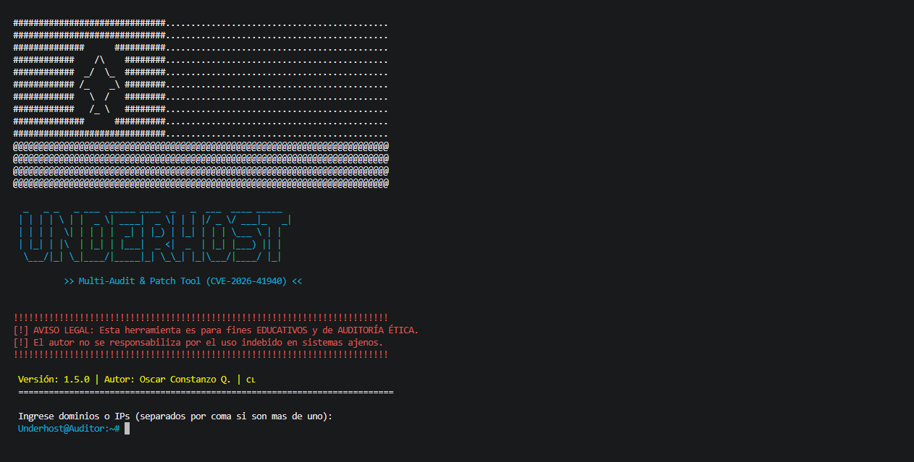
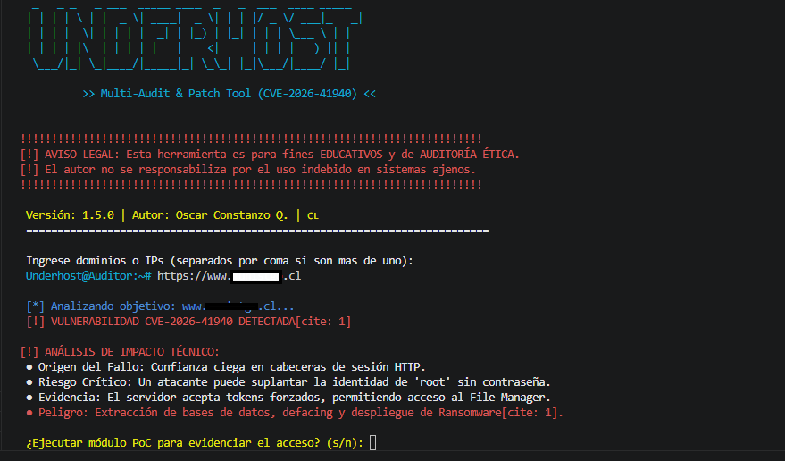
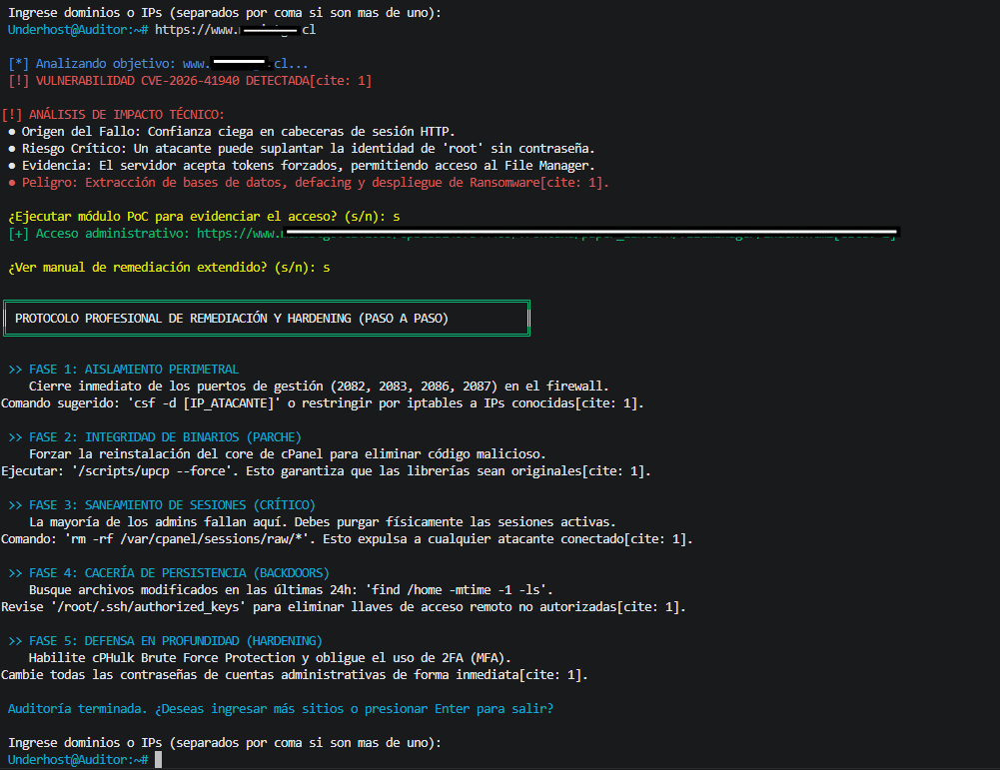

# 🛡️ Oscar Constanzo Audit & Patch Tool (CVE-2026-41940)

[](https://www.python.org/)
[](https://opensource.org/licenses/MIT)

> **Professional Security Auditing & Incident Response Suite for cPanel Infrastructure.**

---


## 📖 Description

This tool was developed by Oscar Constanzo Quezada, AKA Underhost to identify and remediate the CVE-2026-41940 vulnerability in cPanel servers. The flaw allows an **Authentication Bypass** via HTTP session header injection, enabling an attacker to gain full administrative (root) privileges without a valid password.

---

## 🚀 Key Features

*   **THIS TOOL IS CREATED IN SPANISH 🇨🇱
*   **Signature Audit:** Fast scanning to detect vulnerable cPanel versions.
*   **Risk Assessment:** Integrated technical impact analysis explaining the danger to the infrastructure.
*   **Response Manual:** A 5-phase guide for system sanitization and hardening.
*   **Persistence:** Persistent scanning loop for multiple targets.

---
⚠️ Legal Disclaimer
THIS TOOL IS PROVIDED FOR EDUCATIONAL AND ETHICAL AUDITING PURPOSES ONLY.[cite: 1] The author is not responsible for any misuse, damage, or unauthorized access. Use this software on networks only with explicit permission.


## 🛠️ Installation
```bash
# Clone the repository
git clone https://github.com/Underh0st/CPanel-Audit-Remediation-Tool.git

# Enter the directory
cd CPanel-Audit-Remediation-Tool

# Install dependencies
pip3 install -r requirements.txt

# Run the script
python3 ART.py

```

📋 Remediation Protocol
The tool guides the administrator through a professional incident response protocol.

1.Isolation: Restrict access to management ports (2082-2087) via firewall.

2.Patching: Force core update using /scripts/upcp --force.

3.Sanitization: Physical purge of /var/cpanel/sessions/raw/ to invalidate stolen tokens.

4.Threat Hunting: Locate persistence (backdoors) using find /home -mtime -1 -ls.

5.Hardening: Enable cPHulk and Multi-Factor Authentication (MFA).

### Vulnerability Analysis

*Figure 2: Active scanning module successfully identifying CVE-2026-41940 and generating a risk assessment.*

### Incident Response Manual

*Figure 3: Professional 5-phase Incident Response Manual detailing system sanitization and hardening.*

Author
Oscar Constanzo Quezada. (Underhost) - OFFENSIVE HACKER SINCE 2010
